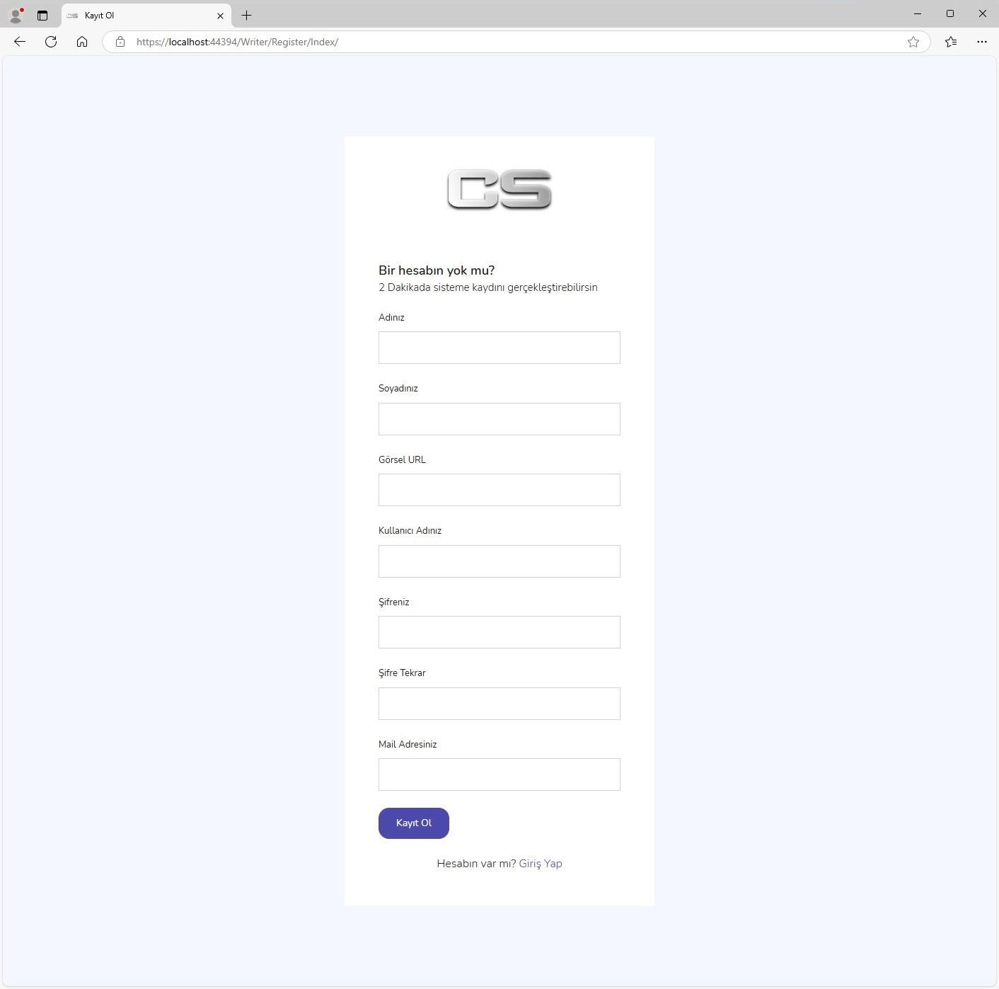
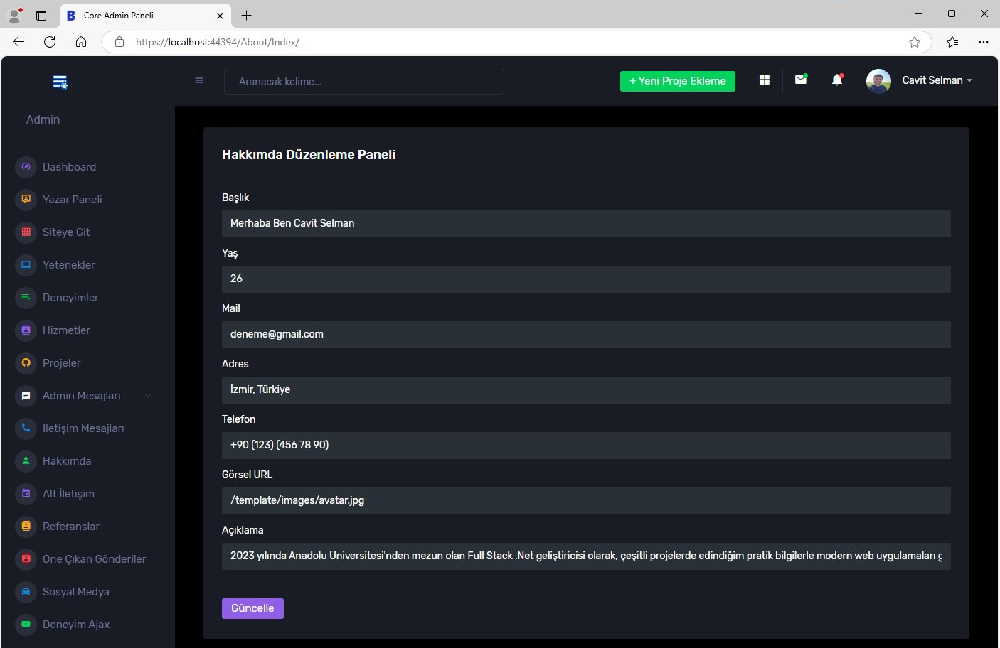
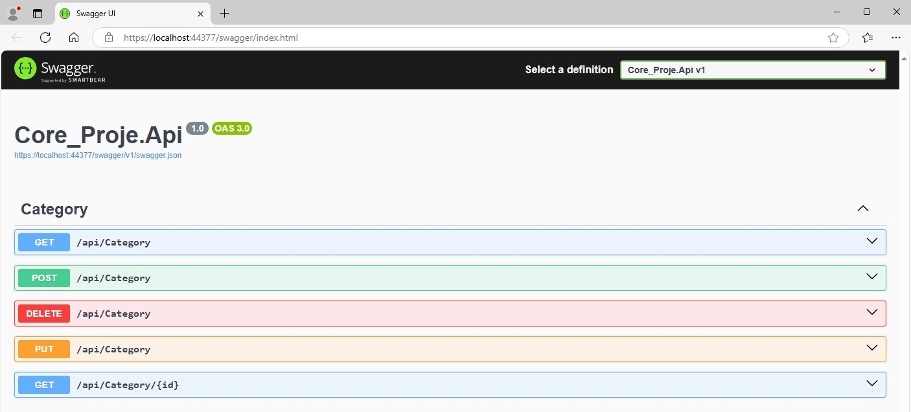

<h1 align="center">ASP.NET Core 8.0 Dinamik Admin ve Yazar Panelli Portfolyo Sitesi</h1>

Bu proje, **ASP.NET Core 8.0** sürümü ile hazırlanmış dinamik bir admin ve yazar paneline sahip bir portfolyo projesidir. Proje, dinamik yapıya sahip çok katmanlı mimari (N-Tier Architecture) ve admin ile yazar paneli içermektedir.

<h2 align="center">Proje Hakkında</h2>

### Admin Paneli
- **CRUD İşlemleri**: Veri tabanı tablolarında tüm dinamik CRUD işlemleri yapılabilmektedir. Yapılan işlemler, ana sayfadaki görünüme eş zamanlı olarak yansır.
- **İstatistik Bilgileri**: İstatistik bilgilerini görebilme.
- **Mesaj Yönetimi**: Gelen ve gönderilen mesajları inceleyebilme, mesaj gönderebilme ve okundu durumunu değiştirebilme.
- **Rol Ataması**: Sadece rolü "Admin" olan kullanıcılar admin paneline giriş yapabilir.
- **Bildirimler**: Üst menüden bildirimleri ve gelen mesajları görüntüleyebilme.
- **Deneyim Sayfası**: Tüm veriler üzerinde AJAX ile CRUD işlemleri yapabilme.
- **Geçiş İmkanları**: Admin, kendi panelinden yazar paneline ve vitrin sayfasına geçiş yapabilir.
- **Hata Sayfaları**: Yetkisi olmayan kullanıcılar ve bulunamayan sayfalar için 404 ve 401 hata sayfaları mevcuttur.

### Yazar Paneli
- **Kullanıcı Bilgileri**: Ad, soyad, şifre, profil resmi (dosya yükleme) gibi bilgileri güncelleyebilme.
- **E-posta Yönetimi**: Admin ve kullanıcılara e-posta gönderebilme ve adminden gelen mesajları görüntüleyebilme.
- **Dashboard**: Yazar panelindeki Dashboard üzerinde tüm istatistik bilgilere dinamik olarak erişim ve hava durumu bilgilerini canlı olarak çekme.

<h2 align="center">Kullanılan Teknolojiler</h2>

### Web Geliştirme
- **ASP.NET Core 8.0**
- **Entity Framework Core**
- **ASP.NET Core Identity & Role Management**

### Mimari
- **N-Tier Architecture**
- **Repository Design Pattern**
- **Code First**

### API ve İletişim
- **AJAX**
- **RESTful API**
- **Fluent Validation**
- **Swagger & Postman (API Kısmında)**

### Veri Tabanı
- **MSSQL**
- **LINQ Sorguları**

### Güvenlik
- **Authentication & Authorization**

<h2 align="center"> Proje Görselleri </h3>

